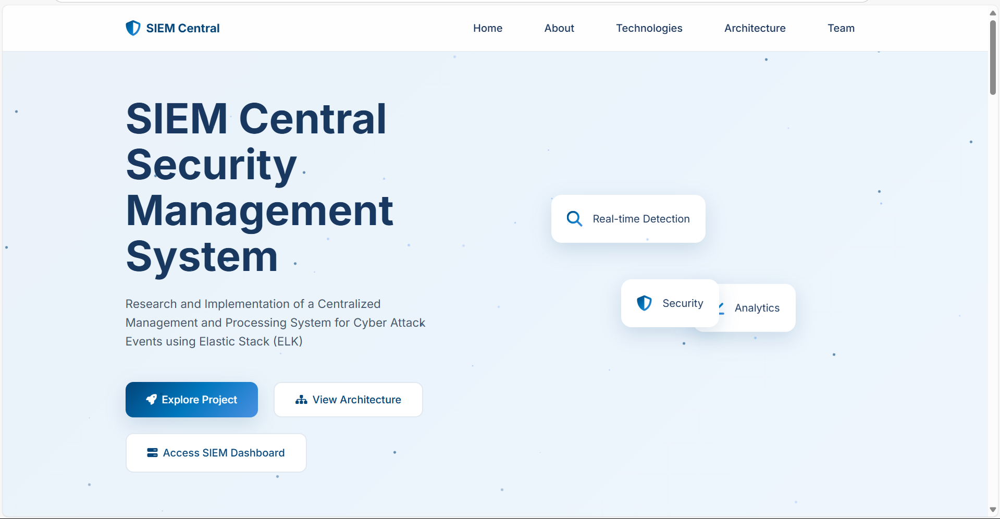

# SIEM Central Web

## Overview
SIEM Central is a web platform showcasing a research and implementation project focused on a Security Information and Event Management (SIEM) system using the Elastic Stack (ELK). This website documents the architecture, technologies, and capabilities of a centralized management and processing system for cyber attack events.

## Project Description
The project demonstrates the deployment of a comprehensive SIEM solution that collects, processes, analyzes, and visualizes cybersecurity events within a simulated environment. It focuses on monitoring logs from Windows and Linux systems, along with security devices like Suricata and pfSense, to detect, investigate, and respond to threats in real-time.

View the full project at: [https://github.com/WanThinnn/SIEM-Central](https://github.com/WanThinnn/SIEM-Central)

## Technologies Used
- **Elastic Stack (ELK):** Elasticsearch, Logstash, Kibana, and Beats (Elastic Agent/Filebeat)
- **Network/Security Devices:** pfSense (router, firewall, log forwarding), Suricata (Inline IDS/IPS)
- **Log Sources:** Windows Event Logs, Linux System Logs, Web Server Logs
- **Other Tools:** Nginx (reverse proxy), Metasploitable2 (attack simulation environment)
- **Query Languages:** Elasticsearch Query DSL, Kibana Query Language (KQL)
- **Frameworks:** MITRE ATT&CK Framework (for mapping detection rules)

## Website Structure
- **Home:** Introduction to the SIEM Central project
- **About:** Detailed project overview and description
- **Technologies:** Information about the tech stack used
- **Architecture:** System design and deployment architecture
- **Team:** Information about project contributors

## Implementation Details
- Custom architecture design based on Elastic Stack
- Log collection from multiple sources using Beats
- Data processing pipelines with Logstash
- Real-time threat detection using Suricata
- Custom detection rules mapped to MITRE ATT&CK Framework
- Interactive dashboards and visualizations with Kibana

## Features
- Real-time security monitoring and analytics
- Comprehensive threat detection capabilities
- Interactive visual representations of security data
- Centralized management of cyber attack events
- Integration with multiple security tools and frameworks

## Getting Started with the Website
1. Navigate through the main sections using the navigation menu
2. Explore the detailed project information in the About section
3. View the system architecture diagrams to understand the implementation
4. Access the SIEM Dashboard via the link in the navigation

## Development
This website is built using:
- HTML5
- CSS3 (with custom grid system and animations)
- JavaScript
- Font Awesome for UI elements
- Responsive design for optimal viewing on all devices

## Collaborator

- **Lại Quan Thiên** - [WanThinnn](https://github.com/WanThinnn)
- **Hồ Diệp Huy** - [hohuyy](https://github.com/hohuyy)

## Last Updated
June 19, 2025
